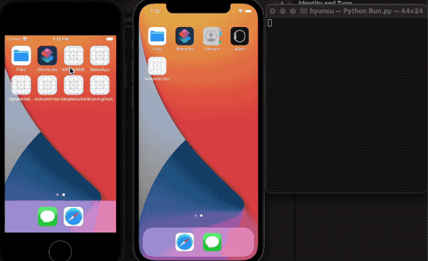

# Purpose

To chat people using sockets by Network.framework - Apple in real-time.

This is simple example for using light tcp-socket 2-way communication.  

# How? 

There are a lot of possible a way to implement 2-way communication like polling, long polling, websockets, sockets.. 

I decided to use socket by using apple framework-Network refering [introducing Network.framework WWDC](https://developer.apple.com/videos/play/wwdc2018/715).

In order to allow server to send receives, I used python socket library making my macbook light server refering [blog](https://nalara12200.tistory.com/153).
